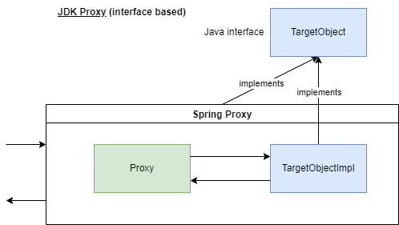
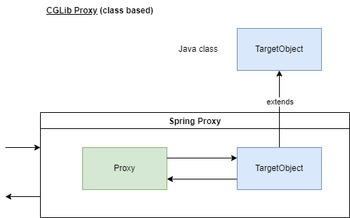

# DOJO Réécrire les bases - Java

## Principe

Dans ce dojo vous allez implémenter des fonctions de bases du langage vous-même. 
Pour cela le corps de fonctions à compléter vous sont fournis vous n'aurez qu'à écrire le code dedans pour répondre aux spécifications. 
Une batterie de tests unitaires vous permettra de vérifier que votre code fonctionne.

## Prérequis - Outils

1. [JDK 17](https://adoptium.net/) minimum
2. [Maven](https://maven.apache.org/download.cgi)
3. Un IDE : [Intellij](https://www.jetbrains.com/fr-fr/idea/download/) ou [Eclipse](https://www.eclipse.org/downloads/packages/) voir [VSCode](https://code.visualstudio.com/) 

## Tester son code

Pour lancer les tests, lancez la commande :

``` bash
mvn test
```

## Règles

Le but est d'implémenter ces fonctions, donc évidement utiliser la version native pour résoudre le problème est interdit. 
Il faut jouer le jeu sinon cela ne sert à rien. La plupart des fonctions peuvent être résolues juste avec une boucle for classique. 
Essayez de vous y cantonner.

## À vous de jouer !

### 1. filter

``` java
public static <T> List<T> filter(List<T> originalLst, Predicate<T> predicate)
```

`filter` va, comme son nom l'indique filtrer les éléments d'un tableau selon une condition et retourner un nouveau tableau avec uniquement les éléments qui remplissent la condition `predicate`.


### 2. map

``` java
public static <T,D> List<D> map(List<T> originalLst, Function<T,D> function)
```

`map` est une projection. On a en entrée une liste de `T` originalLst, et une fonction `function` qui a en entrée un élément de type `T` et en sortie un élément de type `R`. 
On applique cette fonction à l'ensemble des éléments de la liste et on obtient une nouvelle liste de `R`.

### 3. flatMap

``` java
public static <T,D> List<D> flatMap(List<List<T>> originalLst, Function<List<T>, Stream<? extends D>> function)
```

`flatMap`, tout comme map, elle permet d'appliquer une fonction de mappage, mais produit un flux de nouvelles valeurs. Elle peut être utilisée là où nous devons aplatir ou transformer.
On a une liste de liste `originalLst` en entrée et une fonction `function` qui est appliquée à chaque élément et la fonction renvoie le nouveau flux `Stream<D>`.

## Et Spring dans tout ça ?

Nous avons vu comment réécrire les fonctions Stream afin de démystifier un peu tout cela.
Mais quand on travaille avec Spring, les gens parlent de magie.
Dans cet exercice nous allons tenter de créer un mini framework, que l'on va appeler Summer, qui imitera le principe d'inversion de contrôle (IoC) que l'on connait tous bien.
Plusieurs versions sont mises à disposition avec des **TODO** indiquant les bouts de code à compléter.
La structure des projets est également indiquée avec les endroits à modifier. 

### 1. Posons les bases

Dans le package `fr.java.spring.ioc.version1`, vous trouverez une classe `App` qui utilise `PersonService` pour créer et rechercher une personne dans la foulée.
Il vous faudra utiliser l'injection de dépendance manuellement pour utiliser le Service et exécuter les actions.

```
version1
    |_ webapp
    |   |_ dao
    |   |   |_ PersonDAO.java
    |   |   |_ PersonDAOImpl.java
    |   |_ service
    |       |_ PersonService.java
    |       |_ PersonServiceImpl.java
    |_ App1 (à mettre à jour)
```

### 2. Ajoutons un peu de _Context_

Nous allons introduire la notion de contexte, dans le package `fr.java.spring.ioc.version2` vous trouverez une nouvelle version de la webapp mais également les prémices de notre framework :

```
version2
    |_ summer
    |   |_ context
    |       |_ ApplicationContext.java (à mettre à jour)
    |_ webapp
    |   |_ dao
    |   |   |_ PersonDAO.java (à mettre à jour)
    |   |   |_ PersonDAOImpl.java (à mettre à jour)
    |   |_ service
    |       |_ PersonService.java (à mettre à jour)
    |       |_ PersonServiceImpl.java (à mettre à jour)
    |_ App2 (à mettre à jour)
```

Il faudra utiliser, dans la classe `ApplicationContext`, de la reflexion et les annotations présentes dans le package `fr.java.spring.ioc.common.annotation` pour trouver tous les Bean candidats à être instanciés et éventuellement les dépendances vers d'autres Bean.  

#### Annotations

On va utiliser 2 annotations pour définir nos Bean :

- `Autowired` : Avec Spring il est possible d'injecter des dépendances de plusieurs manières mais il est recommandé de la faire via le constructeur.

- `Component` : Pour permettre au framework de connaitre les classes déclarées en tant que Bean, il peut y avoir tout un tas d'annotations que Spring utilise.
                Pour simplifier les explications, on va de notre côté utilisé uniquement `@Component`.

Ref: https://docs.spring.io/spring-framework/docs/current/reference/html/core.html#beans-annotation-config

#### Contexte

Pour simuler le comportement de Spring, on va avoir plusieurs étapes à respecter :

1. Notre classe de contexte va se baser sur une classe principale qui va indiquer le package à partir duquel il faudra scanner les Beans candidats 
2. Récupérer tous les Beans nécessaires au programme
3. Appliquer le même pattern singleton par défaut comme Spring (d'autres scopes existent, mais on va uniquement appliquer celui-ci dans ce DOJO)
4. Vérifier qu'il n'y a qu'une implémentation possible pour un Bean donné (on ne va pas traiter les Qualifier dans cet exemple), et la récupérer
5. Déduire le constructeur à utiliser s'il y a une injection de dépendance possible
6. Et enfin un peu de récursion pour itérer sur tous les Beans de notre programme

Ref: https://docs.spring.io/spring-framework/docs/current/reference/html/core.html#context-introduction

### 3. Proxy AOP

Le principe de Proxy permet d'utiliser un objet qui englobe l'instance du Bean avec lequel on souhaite travailler.
Cela permet d'ajouter des comportements spécifiques en fonction de l'annotation utilisée sur celui-ci.

Avec Spring, il est possible d'utiliser :
- l'implémentation dynamique Java par défaut (JDK dynamic proxies)  


- les proxies CGLIB  


Dans cet exemple, nous allons nous concentrer sur les proxies dynamiques, vous pourrez approfondir le second type via la documentation en référence.

Ref:
- https://www.baeldung.com/spring-aop-vs-aspectj
- https://docs.spring.io/spring-framework/docs/current/reference/html/core.html#aop-introduction-proxies

#### InvocationHandler

Nous allons créer une classe implémentant `InvocationHandler` qui a pour méthode :

```
public Object invoke(Object proxy, Method method, Object[] args)
```

Nous allons stocker le Bean proxifié dans le `ProxyInvocationHandler`, il ne faudra donc pas passer le proxy en paramètre, mais seulement la méthode à appeler et les paramètres de celle-ci.

``` java
public class ProxyInvocationHandler implements InvocationHandler {

    private final Object objectToHandle;

    public ProxyInvocationHandler(Object objectToHandle) {
        this.objectToHandle = objectToHandle;
    }

    @Override
    public Object invoke(Object proxy, Method method, Object[] args) {
        return invokeMethod(method, args);
    }

    private Object invokeMethod(Method method, Object[] args) {
        try {
            return method.invoke(objectToHandle, args);
        } catch (IllegalAccessException | InvocationTargetException e) {
            throw new SummerException("Error occurred in proxy", e);
        }
    }
}
```

Le projet a déjà prévu une annotation `@Cacheable` que nous allons gérée via un `CacheableHandler`.
Celui-ci étends `AbstractProxyHandler` qui définit le comportement de tous les futurs handlers et propose une méthode `isSupported` pour vérifier qu'une méthode a bien l'annotation correspondante au handler instancié.

Il faudra ensuite que notre `ApplicationContext` manipule des objets de type `ProxyInvocationHandler` au travers de la méthode `createBean` et non plus l'instance réelle de nos Bean.

Cela permettra d'ajouter un comportement spécifique pour chaque annotation qui étendra `AbstractProxyHandler`. 

```
version3
    |_ summer
    |   |_ context
    |   |   |_ ApplicationContext.java (à mettre à jour)
    |   |_ handler
    |       |_ AbstractProxyHandler.java (à mettre à jour)
    |       |_ CacheableHandler.java (à mettre à jour)
    |       |_ ProxyInvocationHandler.java (à mettre à jour)
    |_ webapp
    |   |_ dao
    |   |   |_ PersonDAO.java
    |   |   |_ PersonDAOImpl.java
    |   |_ service
    |       |_ PersonService.java
    |       |_ PersonServiceImpl.java
    |_ App3
```

NB : Un piège dans lequel on peut facilement tombé est le fait d'appeler une méthode annotée à l'intérieur même de son Bean.
Cela a pour effet de ne pas repasser par le Proxy géré par le framework et de ne pas exécuter le code associé.

### 4. Conclusion

Nous avons posé les bases du framework :
- Contexte
- IoC
- AOP

Il manque énormément de chose pour couvrir tous les aspects offerts par Spring voir d'autres solutions (Quarkus, Micronaut AOT, ...).
Mais cela permet déjà d'avoir une idée des mécaniques avec lesquelles nous jouons tous les jours.
